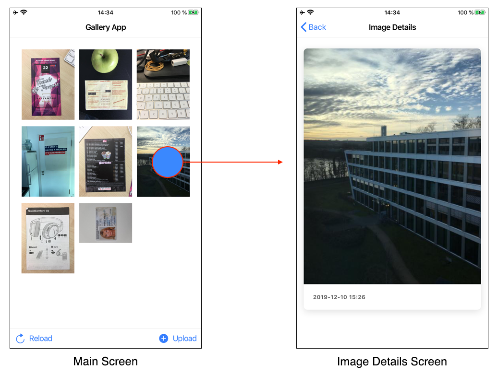

# Scanbot Cross-Platform Mobile Developer Interview Challenge

## The images must be arranged chronologically based on image timestamp i fotgot to implement in this solution.Hope you will not forgot while submitting.


## Context
Your challenge will be​ ​to implement a simple hybrid mobile application for the Android and iOS platforms based on 
[Ionic](https://ionicframework.com) + [Capacitor](https://capacitorjs.com) or alternatively on [React Native](https://reactnative.dev). 
Feel free to choose one of this technology stacks.

Please create a simple image gallery app that will access a server API endpoint, fetch a list of images and present them as thumbnails to the user. 
Furthermore this app should provide a simple upload functionality of new images, which can be selected from the local photo library of the mobile device.


## Requirements

### UI
#### Main Screen
- The Main Screen must have a simple Grid View displaying thumbnails of images returned from the server. The images must be arranged chronologically.
- Add the ability to reload images, e.g. a simple "Reload" button or via "Pull-to-refresh" gesture.
- By tapping on a thumbnail a new page "Image Details Screen" should be opened to display the corresponding image in a bigger view.
  Please use the Navigation Stack approach (don't use a modal dialog or a popup for that).

#### Image Details Screen
- This screen shows an image in a bigger view.
- Use the maximum available width of the screen, with some suitable paddings.
- Display the "timestamp" of the image as formatted date/time (YYYY-MM-DD hh:mm).


Below are simple example mockups of this app to show how it **might** look:




### Upload
On the Main Screen add the ability to select a new image from the Photo Library of the mobile device and to upload this image as a JPG file to the server. 
(single selection is enough, multiple selection is a nice-to-have)

For the native part feel free to choose any 3rd-party plugins from the ecosystems of Ionic/Capacitor/Cordova or React/React Native (e.g. for the Image Picker).


### Platforms
The app should work on both platforms iOS and Android. If you are not able to test/deploy on real devices of both platforms, 
please make sure it works in simulators of those platforms.
The app should be a real **mobile** application. It should **not** be a PWA.


## Server API
API Base URL: `http://54.76.15.222:8090/api/`

API endpoint to fetch the image list:
```
GET : /getImages?appId=<APP_ID>
```
Returns a list of current available images as JSON. An image object is represented as `id`, `url` and `timestamp`. 
Use the `url` to display an image. Use the `timestamp` to arrange the thumbnails chronologically.

API endpoint to upload an image file:
```
POST : /uploadImage?appId=<APP_ID>
```
Requires binary data of the image file (JPG) uploaded as **HTTP Multipart** POST request.
The name of the file part parameter must be `"file"`. Maximum file size is 15 MB per image. 
The uploaded image will be resized by the server and stored in a dedicated storage folder of the given App ID. 
The `getImages` endpoint will return URLs of resized images which can be used as thumbnails and preview images.

⚠️ When testing the app, please do not upload any personal photos!

API endpoint to delete all images:
```
GET : /deleteImages?appId=<APP_ID>
```
Deletes all available images on the server. You can use this **optional** endpoint to cleanup the images during the development phase.

The parameter `<APP_ID>` is your **individual Application ID** and will be provided via email. 
By using this App ID the server creates and manages an individual storage for the images handled by your app implementation.

URL example: `http://54.76.15.222:8090/api/getImages?appId=<APP_ID>`


## Shipping
Please push your project and any instructions the reviewer might need to run your app into this GitHub repo.

We will review your code and evaluate it against criteria such as functional completeness, code structure and architecture​. 
Try to complete this assignment like you would complete a real production task at your workplace. 
We encourage you to use any software design patterns you are familiar with.


## Next Steps
After reviewing your assignment, we will communicate our decision on whether or not to proceed with the next interview.

Please be prepared to present your solution, to discuss your experience, and answer questions regarding the work you provided and your approach to complete this project. 

We look forward to seeing your implementation and to discuss it with you!

Happy coding! 👩🏾‍💻👨‍💻

All the best,

Scanbot Dev Team

## Here is my Solution loooks like below
[![Watch the video] (https://drive.google.com/file/d/1DAOoWApoYSq_CBGr7JI5H15n4APGyrcJ/view?usp=sharing)

